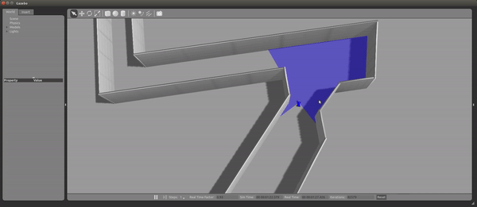
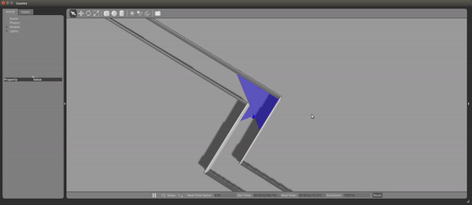
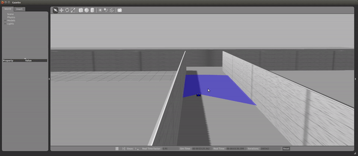

# F1-Tenth Simulation Set-up: 




Instructions
---

* Create your workspace folder. If you are comfortable with Linux, create this in whatever location you desire and name it appropriately, but following this tutorial verbatim will minimize your chance of error.
  ```sh
  $ cd ~/Desktop
  $ mkdir sims_ws
  ```

* Clone the following repositories into a source folder:

  ```sh
  $ mkdir src
  $ cd src
  $ git clone https://github.com/wjwwood/serial.git
  $ git clone https://github.com/mit-racecar/racecar.git
  $ git clone https://github.com/mit-racecar/racecar-simulator.git
  $ git clone https://github.com/mit-racecar/vesc.git
  $ git clone https://github.com/ros-drivers/ackermann_msgs.git
  $ git clone https://github.com/mlab-upenn/f1_10_sim.git
  ```
  
* Turn Python scripts into executables.
  ```sh
  $ cd f1_10_sim/race/scripts
  $ chmod +x *.py
  $ cd ..
  $ cd ..
  ```
  
* Instantiate your workspace. (You should be in 'src' folder now)
  ```sh
  $ catkin_init_workspace
  ```
  
* Move back to your workspace folder and create necessary folders.
  ```sh
  $ cd ..
  $ catkin_make install
  ```
  
* Source the setup.bash file from inside devel.
  ```sh
  $ echo "source ~/Desktop/sims_ws/devel/setup.bash" >> ~/.bashrc
  $ source ~/.bashrc
  ```

* Congratulations! Your F1Tenth simulator is now all set up. The following instructions are to boot up the simulator. Note: Run both thes commands in different terminal windows/tabs. If an address in use error pops up, type killall gzserver and try again.
  ```sh
  $ roscore
  $ roslaunch race f1_tenth.launch
  ```
  
 
 
